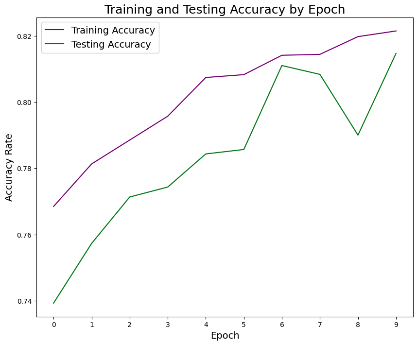
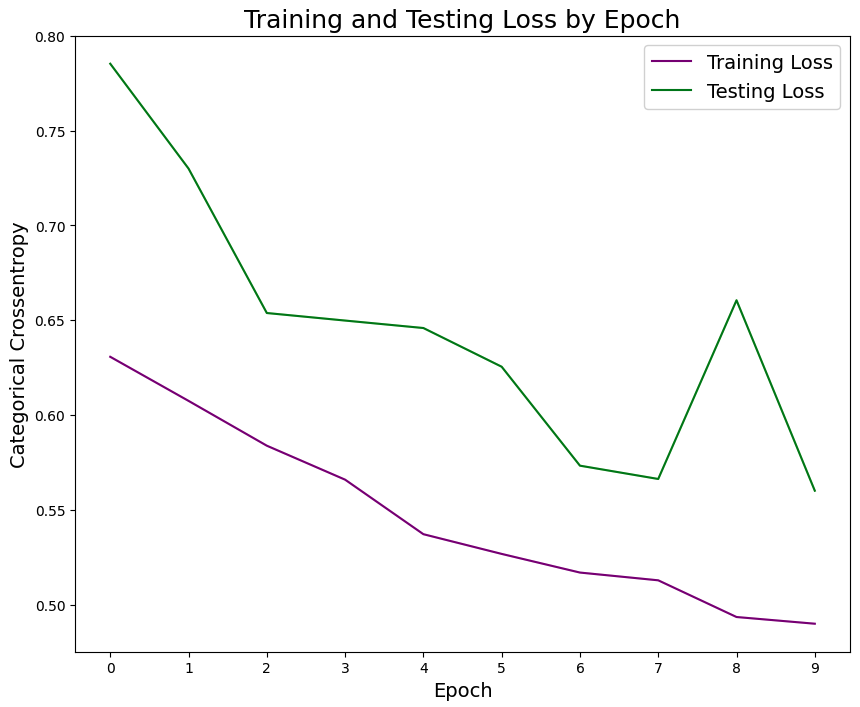
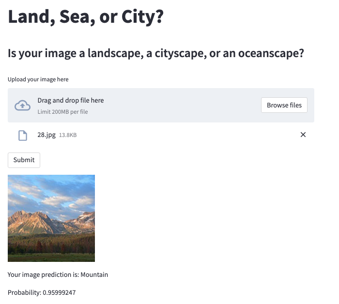

# Neural Net Image Classifier

**Table of Contents**
 [Background](#background)
 [Executive Summary](#executive-summary)
 [Modeling](#modeling)
 [Results](#results)

## Background

This project was created as part of a one-day Hackathon, based on an image classification challenge hosted by [Analytics Vidhya](https://datahack.analyticsvidhya.com/contest/practice-problem-intel-scene-classification-challe/#About). Data provided by Intel.

## Executive Summary

**Problem Statement**: With the ever-expanding reach of smartphones and the increasing quality of their cameras, the number of photos taken around the world each day has grown exponentially. In 2022, there are an estimated 196 million pictures taken every hour. This also leads to increased demand for fast and efficient image processing.

Using Intel's [multi-class dataset](https://www.kaggle.com/datasets/puneet6060/intel-image-classification) of 25k photos, our goal is to build an image classification model that can predict the correct labels for the images with at least 80% accuracy.

**Approach & Goal**: We'll first need to reformat the data to make it usable within our model. From there, we'll be able to test various hyper parameters in our neural net models to hopefully meet our desired accuracy. We'll also be looking at categorical crossentropy in our evaluations.

## Modeling
Notebook can be found [here](intel_image_classification.ipynb).

We set up our first CNN with input, hidden, and output layers, and fit the model with 5 epochs. Our val accuracy here was 0.7643 which was not bad but did not meet our benchmark of 80%.

In our second iteration, we ran our model with a batch size of 128 and 10 epochs. Here, we were able to achieve 0.8147 val accuracy and a 0.60 crossentropy value.

### Accuracy Plot

### Categorical Crossentropy Plot

We can see in both of the above plots that our validation set struggled in the ninth epoch. However, our model was able to reduce overfitting and loss over time.

Our optimal number of epochs appears to sit around the 6-7 range.

We then ran one more model that included early stopping as a callback (holding all else constant) with a minimum delta of 0.05. This model ran for four epochs and reached a val accuracy score of 0.7360.

Our delta may have been a bit large for our model to attain, given that we'd set the patience value to two. However, the first three epochs in this model were 7-20% lower in accuracy than our best model. From here, we decided to use the second trial as our production model.

## Results

We were able to meet our target threshold of 80% accuracy. That being said, we took a more narrow scope during modeling due to the time constraint, but we believe there are a few opportunities for improvement including further tuning of hyperparameters, reduction of model variance, and testing other types of models.

## Streamlit App

The ancillary [Streamlit file](intel-images-streamlit-app.py) is a simple and ready-to-launch app that allows users to upload their own images and receive a class prediction output as well as the confidence level of the model.

